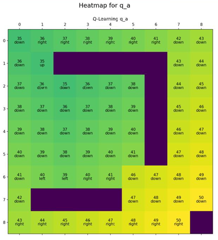

# 🌟 **GridWorld Q-Learning Simulation**

  
> *Explore reinforcement learning with dynamic grid-based strategies!*

---

## 🚀 **Overview**
The **GridWorld Q-Learning Simulation** project is a comprehensive exploration into reinforcement learning using a grid-based environment where two agents learn to navigate optimally. The simulation models an interactive grid world with obstacles (walls), penalty zones (kill zones), and rewarding terminal states. Each agent learns through trial and error, optimizing its policy using the Q-learning algorithm, a model-free RL approach. The project incorporates:

- An **adaptive learning environment** supporting different grid configurations.
- A robust **Q-value update mechanism** to capture state-action values.
- An **epsilon-greedy strategy** for balancing exploration of unknown states and exploitation of known rewards.
- A dynamic **Graphical User Interface (GUI)** built with Tkinter for real-time visualization of agent movements, learning progress, and interactive controls.

This project not only serves as a practical demonstration of reinforcement learning concepts but also as an educational tool to visualize how agents evolve their strategies over episodes. The modular design allows for future enhancements like adding more complex rules or alternative learning algorithms.

---

## ✨ **Key Features**
- 🌐 **Dynamic Grid Environment**: Walls, kill zones, and terminal states.
- 🎮 **Multi-agent Learning**: Two independent players explore and learn.
- 🔍 **Q-Learning Algorithm**: Adjustable epsilon-greedy exploration.
- 🖥️ **Interactive GUI**: Visualize real-time learning with Tkinter.
- 📊 **Performance Visualization**: Generate heatmaps and reward-step graphs.

---

## 📂 **Project Structure**

| File | Description |
|------|-------------|
| `dc.py` | Main GridWorld logic and GUI implementation. |
| `common_classes.py` | Core classes for managing grid cells and positions. |
| `common_functions.py` | Utility functions for plotting and visualizations. |
| `DC Project Report.pdf` | Comprehensive report on project objectives and implementation. |

---

## 🛠️ **Installation and Requirements**

1. **Dependencies**:
   - Python 3.8+
   - Tkinter (pre-installed with Python)
   - Matplotlib (install using `pip install matplotlib`)

2. **Setup**:
   ```bash
   git clone https://github.com/yourusername/gridworld-qlearning.git
   cd gridworld-qlearning
   ```

---

## 🏃‍♂️ **Usage**

1. Run the main simulation:
   ```bash
   python dc.py
   ```

2. **GUI Controls**:
   - 🟢 **Start Q-Learning**: Executes the Q-learning algorithm.
   - 🟠 **Run Sample Episode**: Simulates an episode using the learned policy.

3. **Heatmap Visualization**:
   Use `plot_world` from `common_functions.py` to plot state-action values or rewards.

---

## 🔍 **Core Components**

### 🔹 GridWorld Class
- **Dynamic Setup**: Initializes grid dimensions, player positions, and grid cells.
- **Kill Zones & Terminal States**: Adds penalty and goal cells.
- **Q-Value Updates**: Implements Q-learning to optimize policies.

### 🔹 Q-Learning Algorithm
- **Epsilon-Greedy Action Selection**: Balances exploration and exploitation.
- **Adjustable Parameters**: Tune learning rate and discount factor.

### 🔹 GUI Visualization
- **Real-Time Grid Updates**: Watch agents navigate and learn.
- **Interactive Controls**: Easily start simulations and observe results.

---

## 📊 **Results**

### 1. Heatmap for Q-values

> Optimal actions and state values for each grid cell.


### 2. Reward vs. Steps

> 

> Graphs showing learning progress and efficiency.

---

## 🚀 **Future Enhancements**
- Randomize wall placements and dynamic kill zones.
- Add competitive enemy agents for strategic depth.
- Implement additional RL algorithms for comparison.

---

## 🤝 **Contributing**
I welcome contributions! Feel free to fork the repository and submit a pull request for review.

---

## 📜 **License**
This project is licensed under the [MIT License](LICENSE).


